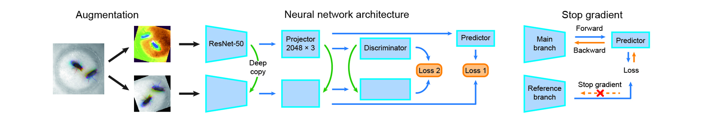

# Selfee: Self-supervised Features Extraction of animal behaviors

This is the official implementation of [Selfee](https://www.biorxiv.org/content/10.1101/2021.12.24.474120v1). In brief, Selfee is a **fully unsupervised** neural network for animal behavior analysis. **It is fast, sensitive, and unbiased.**

<div align=center>

</div>

## Network structure

Selee is inspired by and modified from [SimSiam](https://github.com/facebookresearch/simsiam) and [CLD](https://github.com/frank-xwang/CLD-UnsupervisedLearning):




## A tutorial of Selfee

1. Prepare a Conda environment for Selfee

```
conda env create -f Selfee.yml 
```

2. Download pretrained weights from Google Drive

We provide [pretrained weights](https://drive.google.com/file/d/1A3U5guNEKA3Bi9H3QnfstZDEZ6aesqcR/view?usp=sharing) on flies or mice datasets via Google Drive.

3. Data preprocessing

For data preprocessing, I recommend you to use my [RodentTracker](https://github.com/EBGU/RodentTracker). It also provides other functions, such as animal tracking. Selfee enviroment could support RodentTracker, so you don't need to build a new conda environment.

First, you should arange your data as:

- Experiment_Name
  - Video
    - video1.mp4
    - video2.mp4

Then, edit the template for data preprocessing.
```
home = 'yourFolder' #address of folder "Experiment_Name"
isEPM = False # whether EPM or OFT, always use OFT style for all none EPM setups
startT = 60 # start at 60s of each video, depends on what you need
cropLen = 300 # crop only 300s(5min) for each video, depends on what you need
imgSize = 500 # resize images as 500x500, depends on what you need
margin = 0.2 # keep a margin of 20% image size beyond your selection
useEllipse = False  # whether used ellipise to fit animals, ellipise fitting provides oritation information, but it is less robust
refLenth = 100 # the arm lenth of EPM or size of OFT
centerCutOff = 0.5 # define the center zone, for OFT only!
video2img = True # extract images from video
img2binary = True # substraction of background and normalize illunimation
useAverFrame = True # use averaged frames as background, otherwise use first several frames
tracking = False # perform animal tracking
preview = False # visulize tracking result 
windowSize = 5 #window size for speed
Filter = 'aver' #a function to filter the positon, currently provide 'aver' 'median' 'none'
```

4. Train Selfee

Training process takes 20,000 steps as default, and it usually takes about 8 hours on one nvidia 3090 GPU. Self-supervised learning is very sensitive to batch size, so 24GB GPU memory should be the minimal requirment. Otherwise, you have to implement [checkpoint tricks](https://github.com/prigoyal/pytorch_memonger/blob/master/tutorial/Checkpointing_for_PyTorch_models.ipynb) yourselves. 

You should arrange your training folder as:

- Selfee
  - Saved_Models
    - SimSiam_CLD_ResNet50_initial_FlyCourtship.pkl
  - Embed
  - train_selfee.py
- Datasets
  - Train_Set
  - Test_Set
  - For_Emb

You could slightly modify this scipt from line 25 to line 75:
```
home = os.path.dirname(__file__) # you can change it to your address if training scriot is not under this folder
initializing = False # if initializing, save a .pkl files and train from sketch, else read saved .pkl files
AMP= True # automated mixed precision training
CLD = True # use cld loss
maxLambda = 2.0 # weight of CLD loss
increaseLambda = False # True is NOT recommanded
BYOL = False # True is NOT recommanded
RGB_3F = True # use live frames when True, otherwise raw frames
innerShuffle = True # This sample minibatches from the same video. only use this for data with dramatica batch effect, like mice data.
input_size = [256,192] #image_size,for flies, use 224,224 
base_lr=0.05 # per batchsize256, you can try 0.025
videoSets = '' #fill with the dir name of your dataset
```
## Abstract
Fast and accurately characterizing animal behaviors is crucial for neuroscience research. Deep learning models are efficiently used in laboratories for behavior analysis. However, it has not been achieved to use a fully unsupervised method to extract comprehensive and discriminative features directly from raw behavior video frames for annotation and analysis purposes. Here, we report a self-supervised feature extraction (Selfee) convolutional neural network with multiple downstream applications to process video frames of animal behavior in an end-to-end way. Visualization and classification of the extracted features (Meta-representations) validate that Selfee processes animal behaviors in a comparable way of human understanding. We demonstrate that Meta-representations can be efficiently used to detect anomalous behaviors that are indiscernible to human observation and hint in-depth analysis. Furthermore, time-series analyses of Meta-representations reveal the temporal dynamics of animal behaviors. In conclusion, we present a self-supervised learning approach to extract comprehensive and discriminative features directly from raw video recordings of animal behaviors and demonstrate its potential usage for various downstream applications.
